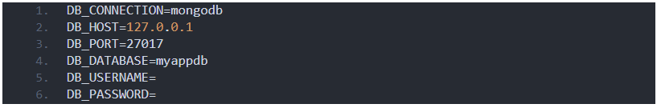
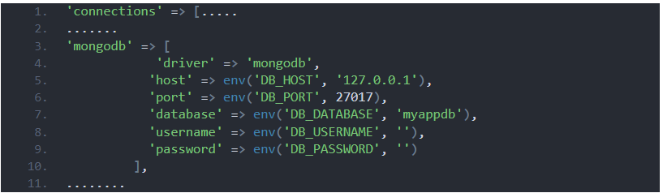
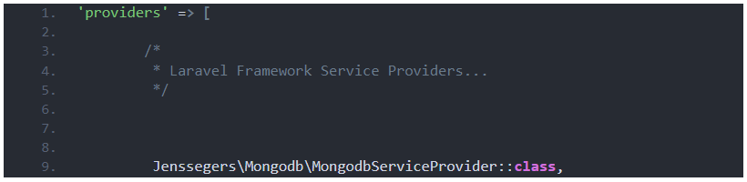
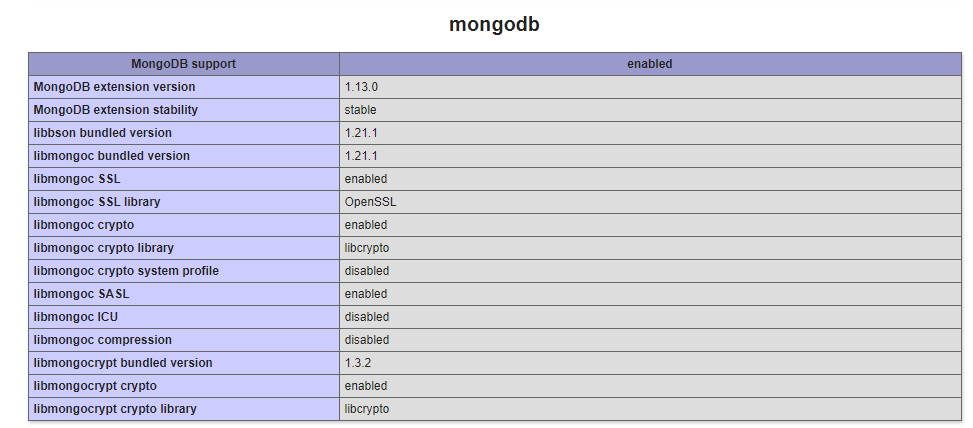

# Laravel8 with Mongodb Integration and crud operation
This is an example of a Laravel8 with Mongodb Integration

After clone you can run it

how to achieve follow a few steps 

## Getting Started

### Step 1: setup database in .env file
````javascript
    env file from your laravel application directory and Configure MongoDB Database
	DB_CONNECTION=mongodb
	DB_HOST=127.0.0.1
	DB_PORT=27017
	DB_DATABASE=myappdb
	DB_USERNAME=
	DB_PASSWORD=
````
 </img>


 ## Step 2:Create a schema for product table.

````javascript
 php artisan make:migration create_products_table --create=products

````

## Step 3:  create a controller and model
````javascript 
	php artisan make:controller ProductController --resource --model=Product

````

## Step 4: In the product model comment the line use Illuminate\Database\Eloquent\Model then add
````javascript 
 
	use Jenssegers\Mongodb\Eloquent\Model;
````
## Step 5: add db connection
    config\database.php file under the “connections” object in Laravel project 
````javascript 
    'mongodb' => [
		'driver'   => 'mongodb',
		'host'     => env('MONGO_DB_HOST', 'localhost'),
		'port'     => env('MONGO_DB_PORT', 27017),
		'database' => env('MONGO_DB_DATABASE'),
		'username' => env('MONGO_DB_USERNAME'),
		'password' => env('MONGO_DB_PASSWORD'),
		'options'  => []
	],
````
 </img>
## Step 6: Set the default database connection name in config\database.php at top section
    'default' => env('DB_CONNECTION', 'mongodb'),

## Step 7: In order to make connections with MongoDB you need Jenssegers Library:
````javascript
    composer require mongodb/mongodb --ignore-platform-reqs
	composer require jenssegers/mongodb --ignore-platform-reqs
````

## Step 7: add dependencies
    If Laravel project does not load dependencies automatically, you may also need to add the following to the provider’s section in your app.php file:

````javascript
    Jenssegers\Mongodb\MongodbServiceProvider::class,
````
 </img>

## Run the project 
    php artisan serve and url /product

## for more mongodb query related
please refer to mongodb  <a href="https://github.com/mongodb/laravel-mongodb#basic-usage">laravel mongodb query</a>.

## installing MongoDB in XAMPP Windows


-    Download mongoDB from this link: <a href="http://www.mongodb.org/downloads">mongodb download</a> (the download button is located under “Community Server” tab). Download and install it
	
-	Download the mongoDB driver from this link:
	https://pecl.php.net/package/mongodb/1.13.0/windows
	
-	Open the ZIP file then extract the file: php_mongodb.dll to C:\xampp\php\ext directory.
-	Go to xampp/php/ and open up php.ini using your favorite editor, add the following lines to your extensions: extension=mongodb
-	Restart XAMPP.
-    create a file in your xampp/htdocs folder, in it put the following code: phpinfo();
 </img>